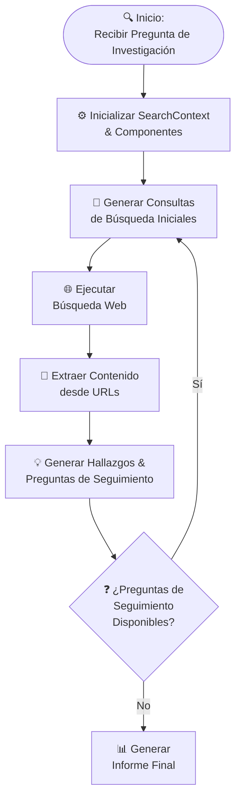

# Agente de Investigación 🔍

El Agente de Investigación es un asistente automatizado que aprovecha la búsqueda web, la extracción de contenido y el procesamiento de modelos de lenguaje para generar informes de investigación completos. Está diseñado para manejar preguntas de investigación complejas mediante la refinación iterativa de consultas de búsqueda, la extracción de contenido relevante y la síntesis de hallazgos.

## 🔄 Flujo del Proceso de Investigación



## 🌟 Características Principales

- **Generación de Consultas:**
  Genera automáticamente consultas de búsqueda diversas y optimizadas basadas en la pregunta de investigación.

- **Búsqueda Web:**
  Ejecuta búsquedas web concurrentes y filtra los resultados para excluir URLs no deseadas (por ejemplo, redes sociales o dominios que requieren inicio de sesión).

- **Extracción de Contenido:**
  Utiliza un rastreador de navegador sin interfaz gráfica (headless) para extraer texto y metadatos de las páginas web.

- **Generación de Hallazgos:**
  Procesa el contenido extraído para producir hallazgos clave y preguntas de seguimiento para un análisis más profundo.

- **Generación del Informe Final:**
  Sintetiza toda la información recopilada en un informe Markdown bien estructurado, que incluye un resumen ejecutivo, análisis y recomendaciones.

## 🚀 Opciones de Instalación

### Opción 1: Docker Compose (Recomendada)

1. Clonar el Repositorio

```bash
git clone https://github.com/abdalrohman/research-agent.git
cd research-agent
```
2. Ejecutar Docker Compose

```bash
docker compose up -d --build
```

3. Acceder al Agente en `http://localhost:9090`

### Opción 2: Configuración Manual

1. Clonar el Repositorio

```bash
git clone https://github.com/abdalrohman/research-agent.git
cd research-agent
```

### 2. Configuración del Entorno Python

Asegúrese de tener Python 3.11+ instalado. Luego, instale las dependencias de Python requeridas:

```bash
pip install -r requirements.txt
```

### 3. Instalación de crawl4ai

El agente utiliza **crawl4ai** para el rastreo web y la extracción de contenido. Siga estos pasos para instalar y configurar crawl4ai:

  1. **Configuración Inicial y Diagnósticos:**

   Después de instalar, ejecute el comando de configuración:

   ```bash
   crawl4ai-setup
   ```

   Este comando:

   - Instalará o actualizará los navegadores Playwright requeridos (Chromium, Firefox, etc.).

   **Diagnósticos Opcionales:**

   Para ejecutar diagnósticos y asegurarse de que todo funcione correctamente, ejecute:

   ```bash
   crawl4ai-doctor
   ```

### 4. Configuración de SearxNG para Búsqueda Web

El Agente de Investigación utiliza **SearxNG** para las búsquedas web. Puede configurar una instancia de SearxNG usando Docker de la siguiente manera:

1. **Obtener la Imagen Docker de SearxNG:**

   ```bash
   docker pull searxng/searxng:latest
   ```

2. **Ejecutar el Contenedor SearxNG:**

   ```bash
   docker run -d -p 8080:8080 searxng/searxng:latest
   ```

   Este comando inicia SearxNG en un contenedor Docker y asigna el puerto 8080 de su máquina host al puerto 8080 del contenedor. Puede ajustar la asignación de puertos según sea necesario.


## 🔧 Configuración

Cree un archivo `.env` en la raíz del proyecto para configurar las variables de entorno.

```bash
cp .env.example .env
```
> NOTA: Lea el archivo `.env.example` para obtener más información sobre las variables de entorno disponibles.

## 📊 Uso

Ejecute el agente mediante el script principal. Por ejemplo:

```bash
python research_agent.py --depth 2 "What are the different types of brain tumors?"
```

Puede personalizar la pregunta de investigación y la profundidad como parámetros. El informe Markdown generado se guardará en la carpeta `./reports`.

## 🗂️ Estructura del Proyecto

```
research-agent/
├── research_agent.py   # Orquestador principal
├── constant.py         # Constantes de configuración
├── decorator.py        # Decoradores de utilidad
├── llm.py             # Integración con LLM
├── models.py          # Modelos de datos
├── search.py          # Funcionalidad de búsqueda
├── utils.py           # Utilidades auxiliares
└── reports/           # Informes generados
```

## 📝 Tareas Pendientes (TODOs)

### Documentación
- [ ] Proveer docstrings claros para todos los métodos y clases públicas

### Gestión de Tokens
- [ ] **Verificación de Seguridad de Tokens**
  - [ ] Implementar una verificación previa del conteo de tokens antes de enviar prompts al LLM
  - [ ] Crear una función de utilidad para truncar o resumir la entrada si excede el límite

### Optimización de Rendimiento
- [ ] **Limitación de Tasa Adaptativa**
  - [ ] Ajustar la duración de `cool_down` según la frecuencia de errores
  - [ ] Implementar ajuste dinámico basado en los tiempos de respuesta del servidor

### Mejora de Búsqueda
- [ ] **Clasificación y Filtrado de Resultados**
  - [ ] Incorporar algoritmos de clasificación sofisticados
  - [ ] Implementar filtrado basado en calidad de los resultados de búsqueda
  - [ ] Agregar sistema de puntuación de credibilidad de fuentes

## 🤝 Contribuir

¡Las contribuciones son bienvenidas! Por favor, abra un issue o envíe un pull request para cualquier mejora o corrección de errores.

## 📄 Licencia

Este proyecto está licenciado bajo la Licencia MIT.
