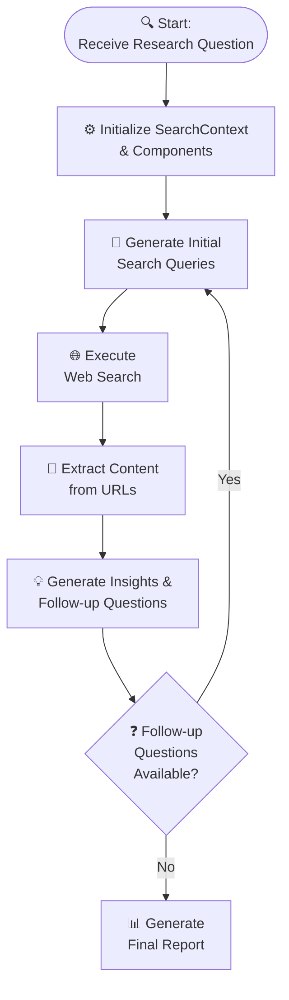

# Research Agent 🔍

The Research Agent is an automated research assistant that leverages web search, content extraction, and language model processing to generate comprehensive research reports. It is designed to handle complex research questions by iteratively refining search queries, extracting relevant content, and synthesizing insights.

## 🔄 Research Process Flow



## 🌟 Key Features

- **Query Generation:**
  Automatically generates diverse and optimized search queries based on the research question.

- **Web Search:**
  Executes concurrent web searches and filters results to exclude unwanted URLs (e.g., social media or login-required domains).

- **Content Extraction:**
  Uses a headless browser crawler to extract text content and metadata from web pages.

- **Insight Generation:**
  Processes extracted content to produce key insights and follow-up questions for deeper analysis.

- **Final Report Generation:**
  Synthesizes all gathered information into a well-structured Markdown report, complete with an executive summary, analysis, and recommendations.

## 🚀 Installation Options

### Option 1: Docker Compose (Recommended)

1. Clone the Repository

```bash
git clone https://github.com/abdalrohman/research-agent.git
cd research-agent
```
2. Run Docker Compose

```bash
docker compose up -d --build
```

3. Access the Agent at `http://localhost:9090`

### Option 2: Manual Setup

1. Clone the Repository

```bash
git clone https://github.com/abdalrohman/research-agent.git
cd research-agent
```

### 2. Python Environment Setup

Ensure you have Python 3.11+ installed. Then, install the required Python dependencies:

```bash
pip install -r requirements.txt
```

### 3. Installing crawl4ai

The agent uses **crawl4ai** for web crawling and content extraction. Follow these steps to install and configure crawl4ai:

  1. **Initial Setup & Diagnostics:**

   After installing, run the setup command:

   ```bash
   crawl4ai-setup
   ```

   This command will:

   - Install or update the required Playwright browsers (Chromium, Firefox, etc.).

   **Optional Diagnostics:**

   To run diagnostics and ensure everything is functioning correctly, execute:

   ```bash
   crawl4ai-doctor
   ```

### 4. Setting Up SearxNG for Web Search

The Research Agent utilizes **SearxNG** for web searches. You can set up a SearxNG instance using Docker as follows:

1. **Pull the SearxNG Docker Image:**

   ```bash
   docker pull searxng/searxng:latest
   ```

2. **Run the SearxNG Container:**

   ```bash
   docker run -d -p 8080:8080 searxng/searxng:latest
   ```

   This command starts SearxNG in a Docker container and maps port 8080 on your host to port 8080 in the container. You can adjust the port mapping as needed.


## 🔧 Configuration

Create a `.env` file in the project root to configure environment variables.

```bash
cp .env.example .env
```
> NOTE: Read the `.env.example` file for more information about available environment variables.

## 📊 Usage

Run the agent by executing the main script. For example:

```bash
python research_agent.py --depth 2 "What are the different types of brain tumors?"
```

You can customize the research question and depth as parameters. The generated Markdown report will be saved in the `./reports` folder.

## 🗂️ Project Structure

```
research-agent/
├── research_agent.py   # Main orchestrator
├── constant.py         # Configuration constants
├── decorator.py        # Utility decorators
├── llm.py             # LLM integration
├── models.py          # Data models
├── search.py          # Search functionality
├── utils.py           # Helper utilities
└── reports/           # Generated reports
```

## 📝 TODOs

### Documentation
- [ ] Provide clear docstrings for all public methods and classes

### Token Management
- [ ] **Token Safety Check**
  - [ ] Implement a pre-check for token count before sending prompts to the LLM
  - [ ] Create a utility function to truncate or summarize input if it exceeds the limit

### Performance Optimization
- [ ] **Adaptive Rate Limiting**
  - [ ] Adjust the `cool_down` duration based on error frequency
  - [ ] Implement dynamic adjustment based on server response times

### Search Enhancement
- [ ] **Result Ranking and Filtering**
  - [ ] Incorporate sophisticated ranking algorithms
  - [ ] Implement quality-based filtering of search results
  - [ ] Add source credibility scoring system

## 🤝 Contributing

Contributions are welcome! Please open an issue or submit a pull request for any improvements or bug fixes.

## 📄 License

This project is licensed under the MIT License.
